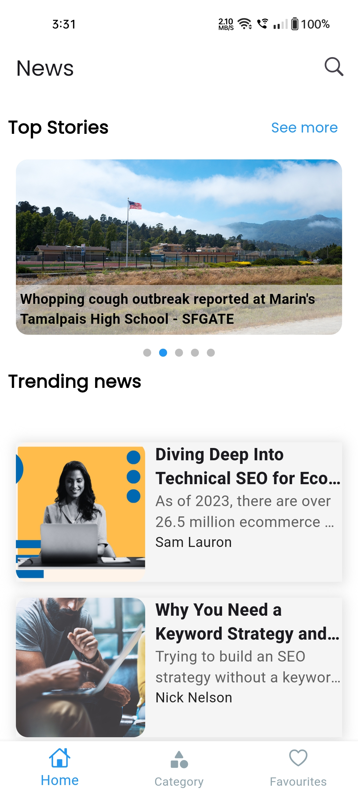
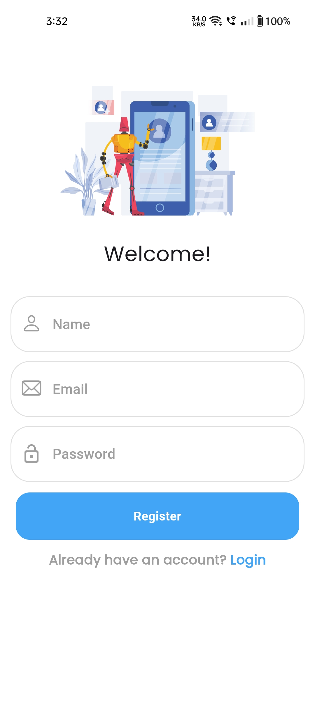
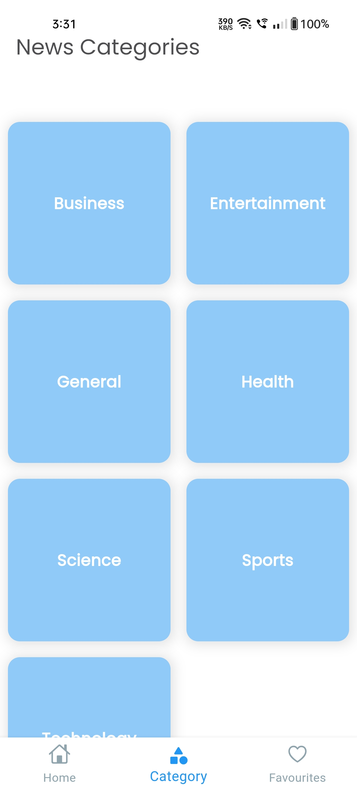
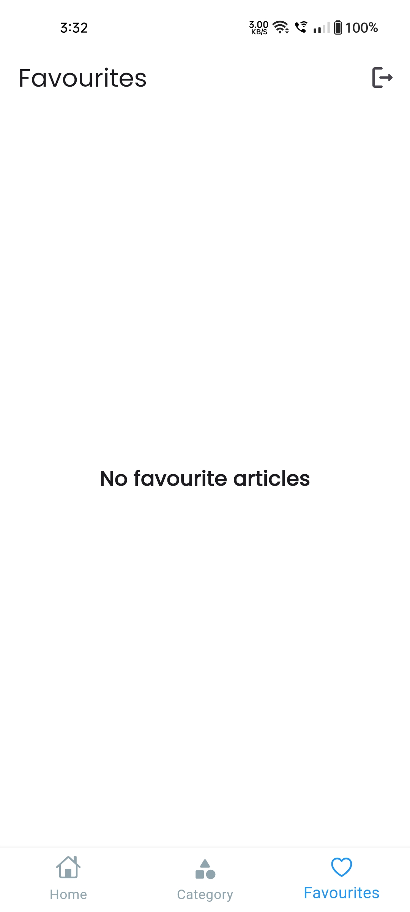
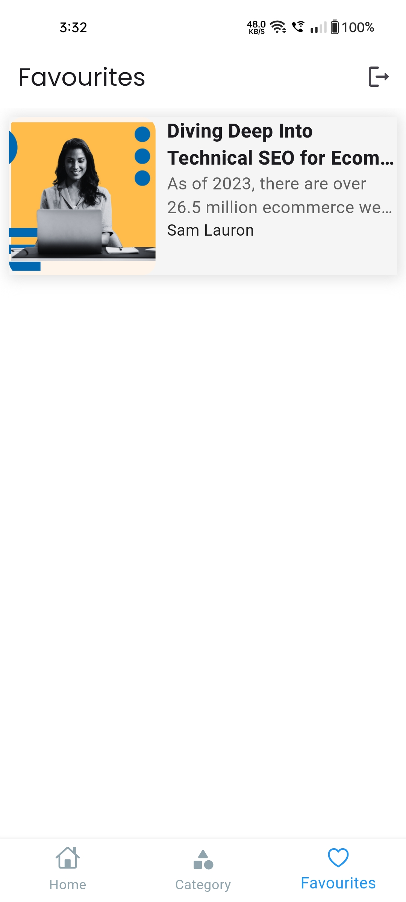

# news_app

## Table of contents

  - [Description](#description)
  - [Screenshot](#screenshot)
  - [Built with](#built-with)
  - [What I learned](#what-i-learned)
  - [Author](#author)

## Description

A News App:
• Developed user registration and login processes to guarantee a smooth and secure onboarding journey for users.
• Explore diverse perspectives on trending topics with the comprehensive news app.
• Stay informed with real-time updates on global events with our intuitive news app.
• Users have the option to bookmark their favorite articles for easy access later.

### Screenshot 
 
 
 
 
 
 

### Built with

- Flutter
- API
- Cloud Firestore
- Firebase Authentication
- Bloc(State Management)

### What I learned
This project taught me a great number of things like accessing different endpoints of an API and integrating Bloc with API & Firebase project. It was an great experience building this project and running into different errors and solving them. 

## Author
- LinkedIn - [Sahil Bansal] (https://www.linkedin.com/in/%F0%9F%8E%AF-sahil-bansal-882b41272/)
- Twitter - [@Sahil121315](https://x.com/Sahil121315?t=91yHYBDE2vjBnehGdAjZ0Q&s=09)
